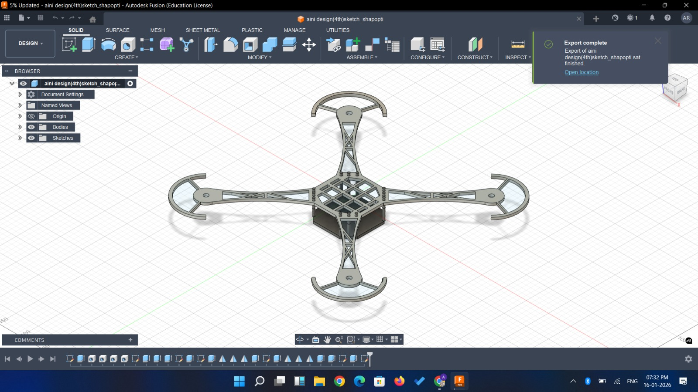
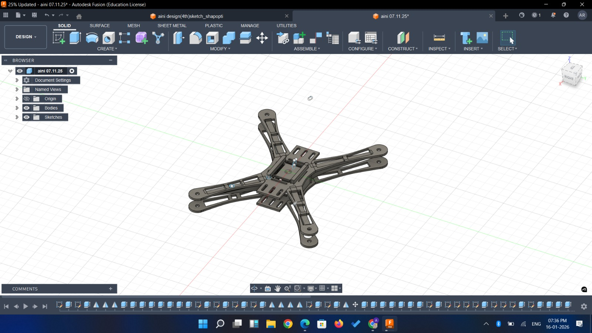

# F450 Drone Frame – CAD Design & Structural Analysis

This repository contains the **CAD design and structural analysis** of an **F450 quadcopter drone frame**, designed using **Autodesk Fusion 360**.  
The project focuses on mechanical design, structural integrity, and feasibility for real-world drone applications.

---

## 🛩️ Project Overview

The objective of this project is to design a robust, lightweight, and manufacturable **F450 drone frame** suitable for research, prototyping, and competitive robotics applications. The frame was modeled with careful consideration of:

- Load distribution  
- Structural stability  
- Practical drone component mounting  
- Real-world flight stresses  

The project also includes a **structural analysis study** to evaluate stress and deformation under applied loads.

---

## 📐 CAD Design (Fusion 360)

Below are two key design iterations of the drone frame developed in Fusion 360:

### 🔹 Design Version 1

### 🔹 Design Version 2

These designs explore variations in frame geometry, arm structure, and mounting layout to optimize strength and weight balance.

---

## 📊 Structural Analysis

A detailed structural analysis was conducted to study:
- Stress distribution  
- Deformation under loading  
- Overall mechanical feasibility  

📄 **Full interactive HTML report:**  
👉 [View Structural Analysis Report](https://ainirzv.github.io/F450-Drone-Frame-CAD-Structural-Analysis-/Studies_Report_2026-01-06.html)

This report was generated to validate the design choices and assess performance under expected operational conditions.

---

## 🧰 Tools & Technologies Used

- **Autodesk Fusion 360** – CAD modeling and simulation  
- **Finite Element Analysis (FEA)** – Structural evaluation  
---

## 🎯 Applications

- Research and academic projects  
- Robotics and UAV competitions  
- Drone prototyping and experimentation  
- Mechanical design and analysis portfolios  

---

## 🚀 Future Work

- Weight optimization and topology refinement  
- Material comparison studies  
- Manufacturing feasibility (CNC / 3D printing)  
- Integration with propulsion and electronics layout  

---

## 👩‍💻 Author

**Aini Rizvi**  
Computer Science & Engineering  
Interest Areas: Robotics, UAVs, AI/ML, Structural Design  

---

⭐ If you find this project interesting or useful, feel free to star the repository!
